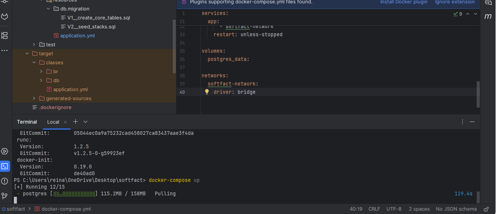
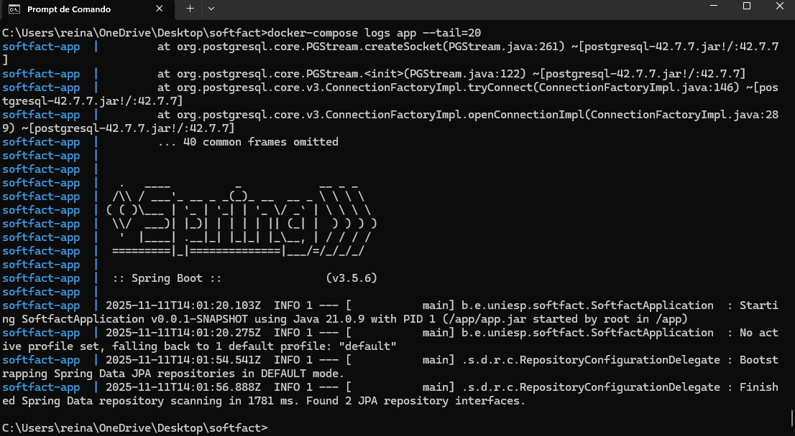
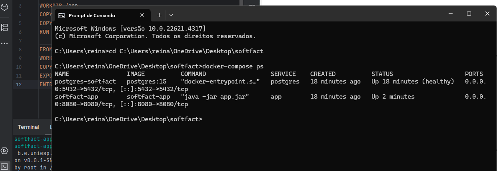

# README - SoftFact API (Spring Boot + Docker)

+ Descrição
    API para gerenciamento de alunos desenvolvida em Spring Boot com PostgreSQL,     containerizada com Docker.

+ Pré-requisitos
    Docker Desktop instalado e rodando

+ Comando Importantes:
    Primeira execução no terminal: docker-compose up --build

    Execuções seguintes no terminal: docker-compose up

    Parar a aplicação no terminal: docker-compose down

    Verifique os containers: docker-compose ps

    Ver logs da aplicação: docker-compose logs app

    Acessar o banco: docker exec -it postgres-softfact psql -U postgres -d       softfact

    Executar em background: docker-compose up -d

    Parar serviços: docker-compose stop

+ Fluxo da Aplicação:
  
    Docker Compose inicia PostgreSQL e aplicação Spring Boot

    Flyway executa migrações do banco automaticamente

    Spring Boot inicia com banco pronto

    API REST fica disponível no endpoint da aplicação

  
  
  
